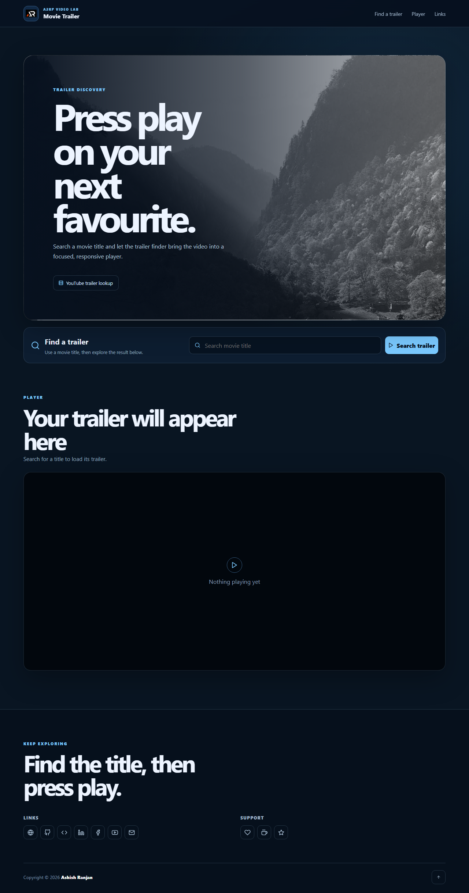

# Movie Trailer

A responsive React movie trailer finder that searches for a title and embeds the returned video in a focused player area.

## Features

- Fixed branded header with local logo and mobile navigation
- Movie title lookup through the `movie-trailer` package
- Responsive ReactPlayer presentation with clear loading and empty states
- Validation and friendly not-found or service-error feedback
- Icon-only social and support footer links with dynamic copyright

## Tech stack

- React and Create React App
- SCSS modules
- movie-trailer and ReactPlayer
- React Icons and React Toastify

## Run locally

```bash
npm install
npm start
```

## Deploy

```bash
npm run deploy
```

## Screenshot



## Links

- Live: [https://a2rp.github.io/movie-trailer/](https://a2rp.github.io/movie-trailer/)
- Repository: [https://github.com/a2rp/movie-trailer](https://github.com/a2rp/movie-trailer)
- Portfolio: [https://www.ashishranjan.net/](https://www.ashishranjan.net/)
- GitHub: [https://github.com/a2rp](https://github.com/a2rp)
- CodePen: [https://codepen.io/ash1198](https://codepen.io/ash1198)
- LinkedIn: [https://www.linkedin.com/in/aashishranjan](https://www.linkedin.com/in/aashishranjan)
- Facebook: [https://www.facebook.com/theash.ashish/](https://www.facebook.com/theash.ashish/)
- YouTube: [https://www.youtube.com/@ashishranjan-ashz?sub_confirmation=1](https://www.youtube.com/@ashishranjan-ashz?sub_confirmation=1)
- Email: [ash.ranjan09@gmail.com](mailto:ash.ranjan09@gmail.com)

## Support

- Support: [https://a2rp-donation-page.netlify.app/](https://a2rp-donation-page.netlify.app/)
- Buy Me a Coffee: [https://buymeacoffee.com/a2rp](https://buymeacoffee.com/a2rp)
- Patreon: [https://patreon.com/a2rp](https://patreon.com/a2rp)